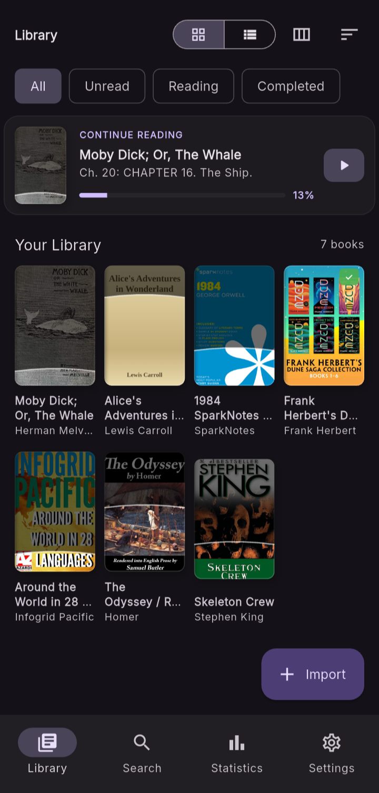

# Library & Management

## The Library View

    

    

        

            The Library is the central hub of SpineLeaf, providing quick access to
            your entire collection while keeping your reading progress organized
            and easy to manage.
        

        

            

                <strong>Continue Reading</strong> 
                
                    Resume books instantly from your last reading position.
                
            

            

                <strong>Reading States</strong> 
                
                    Organize books into Unread, Reading and Completed collections.
                
            

            

                <strong>Library Views</strong> 
                
                    Switch between grid and list layouts to browse comfortably.
                
            

            

                <strong>Import Books</strong> 
                
                    Add EPUB, PDF and other supported formats directly to your library.
                
            

            

                <strong>Search & Statistics</strong> 
                
                    Quickly locate books and monitor your reading activity.
                
            

        

    

## Importing Books

    <video
        controls
        autoplay
        muted
        loop
        style="height:50vh; border-radius:10px;"
    >
        <source src="../../assets/import_book.mp4" type="video/mp4">
    </video>

    

        

            SpineLeaf makes importing books effortless. Browse your device,
            select one or multiple supported files, and they'll be added directly
            to your personal library with their metadata extracted automatically
            wherever possible.
        

        

            

                <strong>Multiple Formats</strong> 
                
                    Import EPUB, PDF, MOBI and other supported reading formats.
                
            

            

                <strong>Native File Picker</strong> 
                
                    Select books directly from your device using the system file browser.
                
            

            

                <strong>Bulk Import</strong> 
                
                    Import multiple books in a single operation to quickly build your library.
                
            

            

                <strong>Automatic Metadata</strong> 
                
                    Book information and cover artwork are detected whenever available.
                
            

            

                <strong>Instant Availability</strong> 
                
                    Newly imported books appear immediately in your library and are ready to read.
                
            

        

    

## Book Details

    <video
        controls
        autoplay
        muted
        loop
        style="height:50vh; border-radius:10px;"
    >
        <source src="../../assets/book_details.mp4" type="video/mp4">
    </video>

    

        

            The Book Details page provides a comprehensive overview of a selected title,
            including reading progress, metadata, and chapter navigation. From here,
            readers can jump to any chapter and manage their reading progress with
            bulk chapter actions.
        

        

            

                <strong>Chapter Navigation</strong> 
                
                    Browse the complete chapter list and open any chapter directly from the details page.
                
            

            

                <strong>Bulk Selection</strong> 
                
                    Select multiple chapters simultaneously for efficient progress management.
                
            

            

                <strong>Reading Progress</strong> 
                
                    Mark selected chapters as read or unread to keep your reading history synchronized.
                
            

            

                <strong>Progress Tracking</strong> 
                
                    Monitor chapter completion percentage and seamlessly continue reading from your last position.
                
            

        

    

