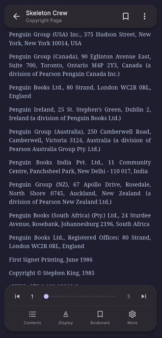
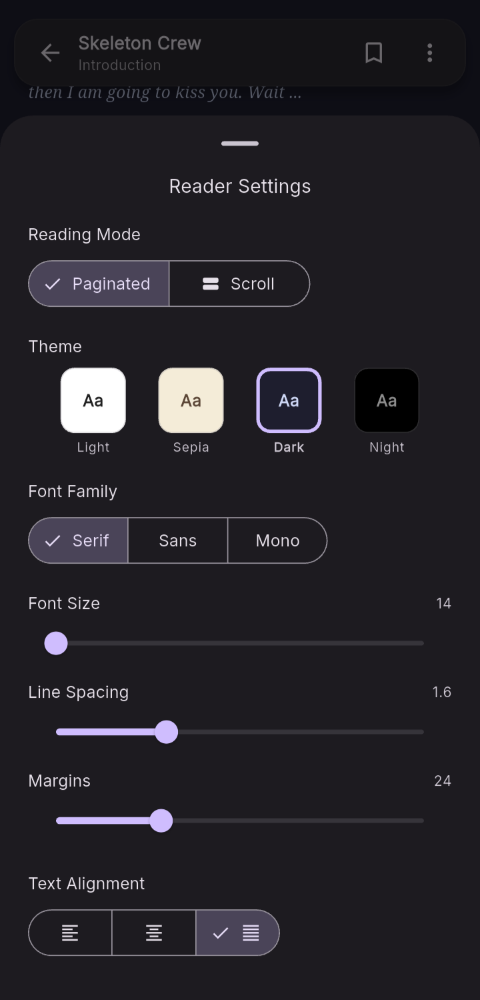

# Reading Experience

SpineLeaf supports a rich reading experience for both EPUB and PDF files.

## Reader Interface

    

    

        

            SpineLeaf's reader is designed to minimize distractions while keeping
            essential tools within easy reach. Navigation controls, reading progress,
            and quick actions are always accessible without interrupting the reading
            experience.
        

        

            

                <strong>Immersive Reading</strong> 
                
                    A clean interface prioritizes book content while minimizing visual distractions.
                
            

            

                <strong>Reading Progress</strong> 
                
                    Navigate chapters quickly using the integrated progress slider and page indicator.
                
            

            

                <strong>Quick Actions</strong> 
                
                    Access the Table of Contents, Reader Settings, Bookmarks, and additional tools from the bottom toolbar.
                
            

            

                <strong>Distraction-Free Controls</strong> 
                
                    Reader controls remain unobtrusive and can be accessed only when needed, allowing the focus to stay on the text.
                
            

        

    

## Reader Controls

    <video
        controls
        autoplay
        muted
        loop
        style="height:50vh; border-radius:10px;"
    >
        <source src="../../assets/reader_control.mp4" type="video/mp4">
    </video>

    

        

            Reader controls are designed to feel natural and unobtrusive, allowing
            navigation through a book using simple gestures while keeping essential
            reading tools only a tap away.
        

        

            

                <strong>Page Navigation</strong> 
                
                    Swipe left or right to move seamlessly between pages in paginated reading mode.
                
            

            

                <strong>Quick Access Menu</strong> 
                
                    Open the reader menu from the top-right corner to access additional reading tools and options.
                
            

            

                <strong>Context-Aware Controls</strong> 
                
                    Reader controls remain unobtrusive during reading and appear only when interaction is required.
                
            

            

                <strong>Fluid Reading Experience</strong> 
                
                    Navigation and menu interactions are optimized to keep transitions smooth and responsive throughout the reading session.
                
            

        

    

## Reader Settings

    

    

        

            Reader Settings allow every aspect of the reading experience to be
            personalized. From typography and themes to layout and navigation,
            each option is designed to help readers create a comfortable reading
            environment tailored to their preferences.
        

        

            

                <strong>Reading Modes</strong> 
                
                    Switch between paginated and continuous scrolling modes depending on your preferred reading style.
                
            

            

                <strong>Themes</strong> 
                
                    Choose from Light, Sepia, Dark, and Night themes to suit different lighting conditions.
                
            

            

                <strong>Typography</strong> 
                
                    Customize font family, font size, line spacing, margins, and text alignment for optimal readability.
                
            

            

                <strong>Live Preview</strong> 
                
                    Changes are applied instantly, allowing you to preview adjustments without leaving the reader.
                
            

        

    

## Dictionary

    <video
        controls
        autoplay
        muted
        loop
        style="height:50vh; border-radius:10px;"
    >
        <source src="../../assets/dictionary.mp4" type="video/mp4">
    </video>

    

        

            The integrated dictionary allows readers to instantly look up the
            meaning of unfamiliar words without leaving the reading session.
            Definitions are displayed contextually, helping maintain reading flow
            while improving comprehension.
        

        

            

                <strong>Contextual Lookup</strong> 
                
                    Select any word while reading and retrieve its definition directly within the reader.
                
            

            

                <strong>Seamless Reading</strong> 
                
                    Access word definitions without switching applications or interrupting your reading session.
                
            

            

                <strong>Detailed Definitions</strong> 
                
                    View concise meanings and supporting information to better understand unfamiliar vocabulary.
                
            

            

                <strong>Integrated Reader Experience</strong> 
                
                    Dictionary functionality is fully integrated into the reading interface for quick and intuitive access.
                
            

            

                <strong>Supports Continuous Learning</strong> 
                
                    Encourage vocabulary building while maintaining focus on the book, making every reading session an opportunity to learn.
                
            

        

    

