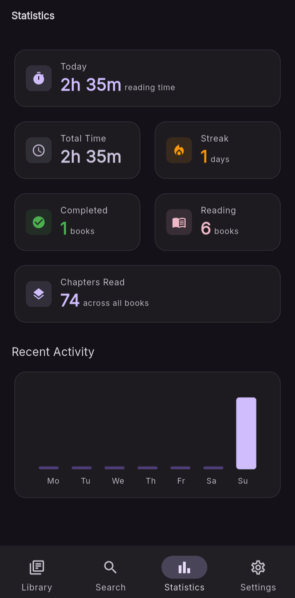

# Statistics

## Statistics

    

    

        

            The Statistics dashboard provides a concise overview of your reading
            habits, helping you monitor progress, maintain consistency, and gain
            insights into your reading journey over time.
        

        

            

                <strong>Reading Activity</strong> 
                
                    Track today's reading time alongside your cumulative reading hours.
                
            

            

                <strong>Progress Overview</strong> 
                
                    View completed books, active reads, and total chapters read across your library.
                
            

            

                <strong>Reading Streaks</strong> 
                
                    Stay motivated by maintaining daily reading streaks and consistent reading habits.
                
            

            

                <strong>Weekly Activity</strong> 
                
                    Visualize your reading activity throughout the week with an easy-to-read activity chart.
                
            

        

    

