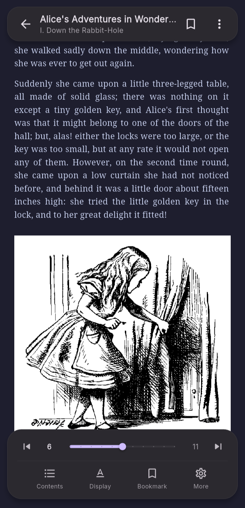
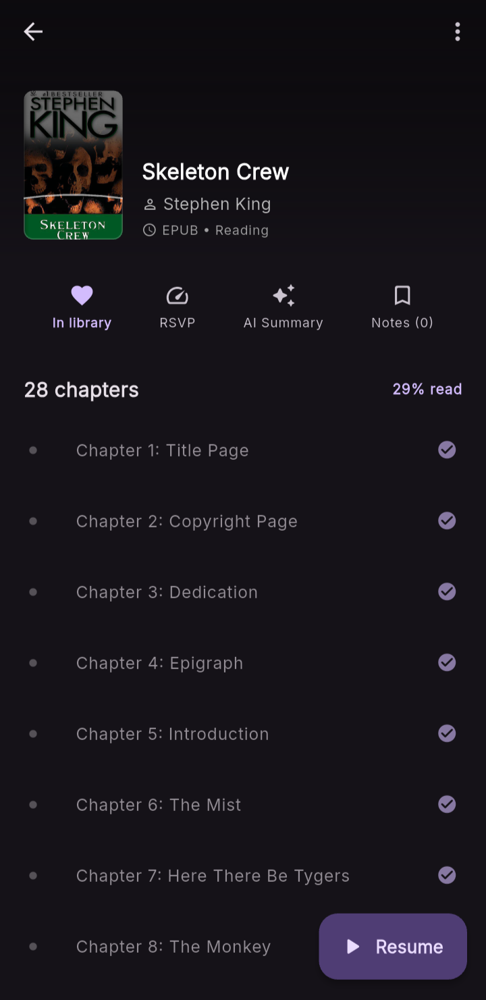

  
  <h1>SpineLeaf E-Book Reader</h1>

Welcome to the documentation for **SpineLeaf**, a modern E-Book and PDF reader application built with Flutter and Material 3. 

## Overview

  
  
  

SpineLeaf provides a comprehensive reading experience, featuring EPUB and PDF parsing, local database storage, detailed reading statistics, and an innovative RSVP (Rapid Serial Visual Presentation) speed-reading mode.